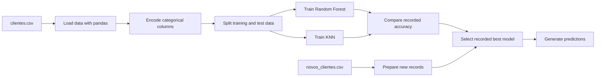

# Architecture

## Scope

This repository is an educational notebook-based data science project. It demonstrates a supervised multiclass classification workflow for credit score prediction in a fictional business context.

## Pipeline

## Repository Components

| Path | Purpose |
| --- | --- |
| `main.ipynb` | Original end-to-end notebook. |
| `clientes.csv` | Training and evaluation dataset used by the notebook. |
| `novos_clientes.csv` | New records used by the notebook for example predictions. |
| `Imagens do Projeto/` | Original explanatory images referenced by the documentation. |
| `Modelos de IA usados/` | Original short notes about the models. |
| `docs/` | Multilingual documentation. |
| `reports/` | Consolidated project report and figure guide. |

## Notes

- The notebook uses `RandomForestClassifier` and `KNeighborsClassifier`.
- The notebook comments sometimes refer to the Random Forest model as a decision tree. The documentation distinguishes the implemented estimator from the conceptual tree illustration.
- The train/test split does not define `random_state`, so metrics may differ when the notebook is executed again.
